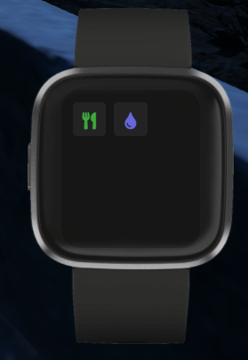

# ⌚ fitbit

## Introduction

Makes an item in-game named "fitbit" on use it shows a NUI that the user can set levels for hunger/thirst levels and when the user hits the alert threshold this resource makes a sound and alerts the player via a chat message

!!! info
    This resource has no configuration file or dependencies other than core

## Preview

