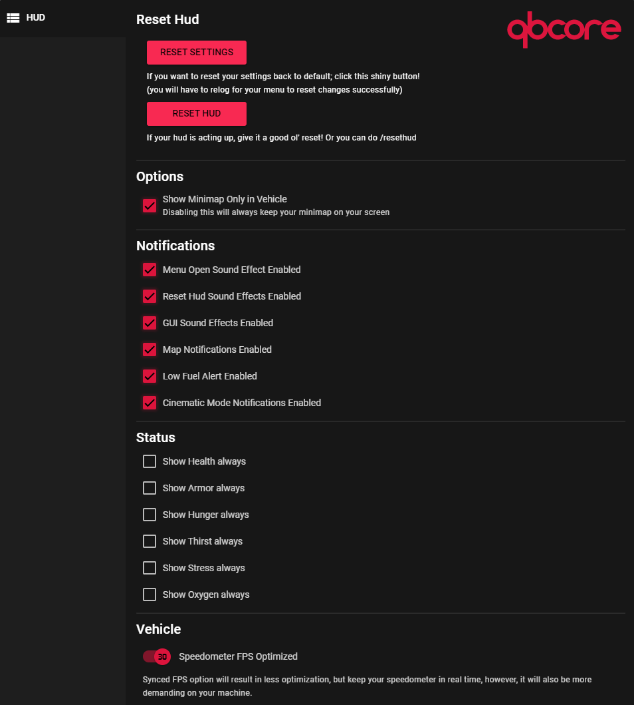

# 📟 qb-hud

## Introduction

* Player heads-up display that tracks vital information such as health, armor, food level, thirst level, etc.

!!! info
    The settings menu uses keymapping and is defaulted to "I"

!!! danger
    Player settings are stored using KVP which is located on the player's machine so the only way to reset them is by using the in-game menu buttons

## Preview

## FAQ&#x20;

Why do my borders not align with the maps?

Most of the time it generally means your safezone is not set to default in your GTA settings. (Settings/Display/"Restore Defaults")

How do I enable dev mode?

Simple! All you have to do is type /admin and navigate through the menu to the last section called "Developer Options" and inside there you should see "Dev Mode", this will keep you invincible and add a cool developer icon in your circles/radials

What does the purple circle/radial do?

That is your harness indicator! When you have the item "harness" in your inventory and while in a vehicle it will appear. Also, when you use your item "harness", the circle/radial will reflect the amount of uses left and decrease over time.

## Useful events

