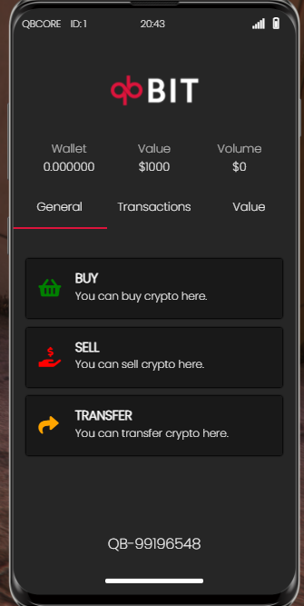

# 🪙 qb-crypto

## Introduction

* This resource handles the cryptocurrency market for players to be able to buy/sell qbit. It also includes an item called a "cryptostick" that can be exchanged at a configured location for qbit. Some jobs have this item as a random reward already

!!! warning
    This resource only works with qb-phone. Without it, players will not be able to buy or sell qbit!

## Preview

## Configuration

## Commands

* /setcryptoworth - Admin only command to set a crypto types worth
* /checkcryptoworth - Check the current worth of qbit
* /crypto - View your qbit balance and worth

## Items

* cryptostick - Players can take these to the exchange point and get crypto from them
