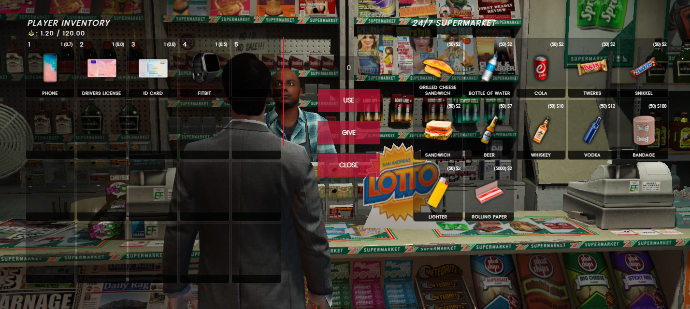
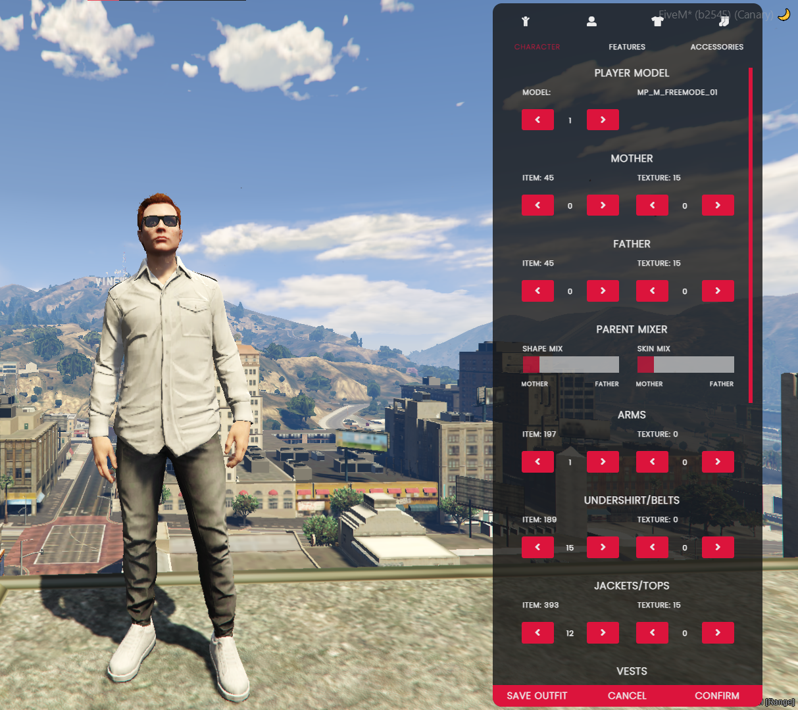

# 🏪 qb-shops

## Introduction


## Preview



## Configuration

### Locations

```lua
Config.Locations = {
    ["247supermarket"] = { -- index must be unique!
        ["label"] = "24/7 Supermarket", -- map blip label
        ["coords"] = vector4(24.47, -1346.62, 29.5, 271.66), -- shop location
        ["ped"] = 'mp_m_shopkeep_01', -- if using target, spawns ped defined here
        ["scenario"] = "WORLD_HUMAN_STAND_MOBILE", -- applies scenario to ped
        ["radius"] = 1.5, -- radius around location to trigger draw text
        ["targetIcon"] = "fas fa-shopping-basket", -- change the qb-target icon
        ["targetLabel"] = "Open Shop", -- change the qb-target label
        ["products"] = Config.Products["normal"], -- products type, see below
        ["showblip"] = true, -- enable/disable map blip
        ["blipsprite"] = 52, -- https://docs.fivem.net/docs/game-references/blips
        ["blipcolor"] = 0 -- change the map blip color
    }
}
```

### Products

!!! info
    Make sure the index of the products table matches the index in the shop locations table otherwise it won't show up in the shop!


```lua
Config.Products = {
    ["normal"] = { -- product type to specify which shop it's shown in
        [1] = {
            name = "tosti", -- item name
            price = 2, -- item price
            amount = 50, -- item stock amount
            info = {}, -- item info
            type = "item", -- item type
            slot = 1, -- inventory slot to be shown in
            requiredJob = { "mechanic", "police" } -- lock this shop to job/s
            requiresLicense = true -- require weapon license to purchase
        }
    }
}
```

---
description: Ohhh, looking fly!
---

# 👕 qb-clothing

## Introduction

This resource manages outfits and creating your character. Easily configurable by location in the config and features a minimalistic UI for users to understand.

!!! warning
    This resource does not manage replacement or add-on clothes! It only manages outfits if you want to learn more about replacement clothes in FiveM click [here](https://forum.cfx.re/t/how-to-streaming-new-hairstyles-for-characters-step-by-step-for-dummies/1048980).


## Preview



## Configuration

### Player Models

`Config.ManPlayerModels` and `Config.WomanPlayerModels` are [ped models](https://docs.fivem.net/docs/game-references/ped-models/) available for the player to change to.

### Locations&#x20;

```etlua
Config.Stores = {
    [1] = {
        shopType = 'clothing', -- clothing/barber/surgeon
        coords = vector3(1693.32, 4823.48, 41.06),
        width = 2,
        length = 2
    },
}
```

!!! info
    This uses a [BoxZone](https://github.com/mkafrin/PolyZone/wiki/BoxZone) the more width and length the bigger the zone&#x20;


### Clothing Rooms

```etlua
Config.ClothingRooms = {
    [1] = {
        requiredJob = 'police', -- Can be job or gang name
        isGang = true/false, -- If above is a gang name then make true
        coords = vector3(454.43, -988.85, 30.69),
        width = 2,
        length = 2,
        cameraLocation = vector4(454.42, -990.52, 30.69, 358.48)
    },
}
```

### Job Outfits&#x20;

```etlua
Config.Outfits = {
    ['police'] = { -- Job/Gang
        ['male'] = { -- Gender
            [0] = { -- Grade Level
                [1] = { -- Outfits
                    outfitLabel = 'Short Sleeve',
                    outfitData = {
                        ['pants'] = {item = 24, texture = 0}, -- Pants
                        ['arms'] = {item = 19, texture = 0}, -- Arms
                        ['t-shirt'] = {item = 58, texture = 0}, -- T Shirt
                        ['vest'] = {item = 0, texture = 0}, -- Body Vest
                        ['torso2'] = {item = 55, texture = 0}, -- Jacket
                        ['shoes'] = {item = 51, texture = 0}, -- Shoes
                        ['accessory'] = {item = 0, texture = 0}, -- Neck Accessory
                        ['bag'] = {item = 0, texture = 0}, -- Bag
                        ['hat'] = {item = -1, texture = -1}, -- Hat
                        ['glass'] = {item = 0, texture = 0}, -- Glasses
                        ['mask'] = {item = 0, texture = 0} -- Mask
                    }
                },
            }
        }
    }
}
```


Cat cafe uitleg


---
description: Welcome to your complimentary apartment
---

# 🏨 qb-apartments

## Introduction

* This resource manages the apartment system for players. It uses qb-interior to spawn shells at a specific set of coordinates and functions the same as housing except by default the apartments do not cost any money

## Preview


## Configuration

```lua
Apartments = {}
Apartments.Starting = true/false -- Enable or disable starting apartments
Apartments.SpawnOffset = 30 -- How far under the map the apartment shell will spawn
Apartments.Locations = { -- Create new apartment locations
    ["apartment1"] = {
        name = "apartment1", -- The apartment name that saves in the database
        label = "South Rockford Drive", -- The label of the apartment (shown in preview)
        coords = { -- The apartment entrance location
            enter = vector4(-667.02, -1105.24, 14.63, 242.32),
        },
        polyzoneBoxData = { -- The polyzone box information for the entrance
            heading = 245,
            minZ = 13.5,
            maxZ = 16.0,
            debug = false,
            length = 1,
            width = 3,
            distance = 2.0,
            created = false
        }
    },
}
```


---
description: Buy & customize your dream home!
---

# 🏡 qb-houses

## Introduction

* Allows players to purchase homes that are created by those with the real-estate job. They can decorate them, have a personal garage and share keys with their friends


## Preview


## Configuration

### Generic

```lua
Config = {}
Config.MinZOffset = 30 -- how far under the ground shells will spawn
Config.RamsNeeded = 2 -- how many stormram items are needed to raid a house
Config.UnownedBlips = false -- enable/disable unowned house blips on the map
Config.Houses = {} -- populates automatically on server start
Config.Targets = {} -- populates automatically on server start
Config.Furniture = {} -- pre-filled with tons of options
```

### Shells

* Found in qb-houses/client/main.lua at line 697

```lua
local function getDataForHouseTier(house, coords)
```

## Commands

* /decorate - Allows the player decorate the house
* /createhouse \[price] \[tier] - Creates a house and saves it to database
* /addgarage - Adds a garage to nearby house
* /enter - Enters the nearby house
* /ring - Rings the bell of nearby house

## Items

* police\_stormram - Allows on-duty police to enter and search a player's home


---
description: Which shell will it be?
---

# 🏠 qb-interior

## Introduction

* Handles all the logic for spawning shell models by exporting functions that can be called in other client-side files

## Configuration

!!! info
    This resource requires no configuration unless you want to add more exports


## What's included?

!!! info
    The below pdf file shows which shell models come by default




!!! info
    Optionally, this resource comes pre-configured for all of [K4MB1](https://www.k4mb1maps.com/) shells!


## Usage example

```lua
RegisterCommand('spawnshell', function()
    local ped = PlayerPedId()
    local coords = GetEntityCoords(ped)
    local shell = exports['qb-interior']:CreateApartmentShell(coords)
end)
```
