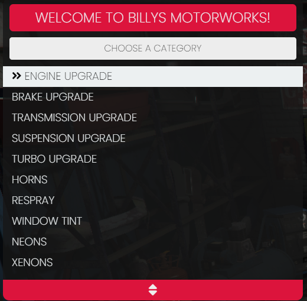
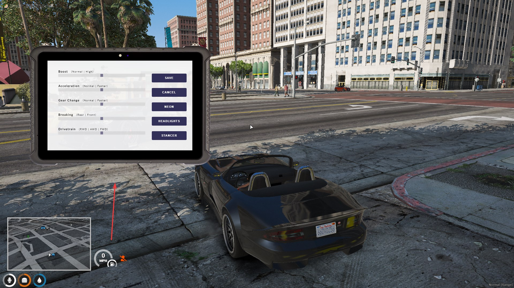

# 🎨 qb-customs

## Introduction

* Handles all vehicle customization and can be locked to a job or open to all players

## Preview

## Configuration

### General

### Locations

### Vehicle Upgrade Pricing

### Vehicle Respray Categories

### Vehicle Window Tints

### Vehicle Headlights

### Vehicle Wheels

### Vehicle Tire Smoke

### Vehicle Neons

# 💻 qb-tunerchip

## Introduction

* Handles the logic for tuning your car with a in game item called "tunerlaptop"
* Handles the logic for nitrous

!!! info
    This resource has no configuration file

!!! warning
    If you want to use wheel stancing then you must install [vstancer](https://github.com/carmineos/fivem-vstancer)

## Preview

## Items

* tunerlaptop - Use it in a vehicle to open the tuner NUI
