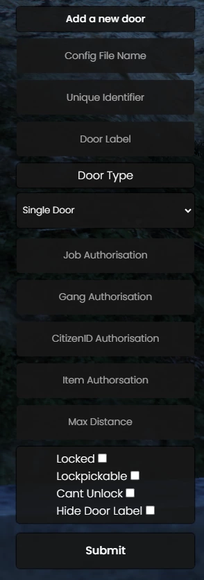

NOTE TO SELF: Eerst uitleg over voertuigen (eventueel alle merken enz noteren)


# 🚪 qb-doorlock

## Introduction

* This doorlock system is based on [nui\_doorlock by thelindat](https://github.com/thelindat/nui\_doorlock) and contains compatibility with its format

## Preview



## Configuration

!!! danger
    DO NOT CHANGE THE DEFAULT BANK DOORS IN THE CONFIG IF USING QB-BANKROBBERY


!!! info
    The door id is the index of the door config table


### General

```lua
Config = {}
Config.CommandPermission = 'god' -- permission level for creating new doors
Config.AdminAccess = false -- Enable admins to unlock any door
Config.AdminPermission = 'god' -- The permission needed to get AdminAccess if it is enabled
Config.Warnings = false -- if true it will show warnings in the console when certain requirements aren't met
Config.FallbackDistance = 3.0 -- Distance to fall back on when it is not set
Config.EnableSounds = true -- Enable sounds when unlocking/locking doors (doors triggered by scripts can have the sound manually disabled)
Config.EnableAnimation = true -- Enable the animation when unlocking/locking doors (doors triggered by scripts can have the animation manually disabled)
Config.SaveDoorDialog = true -- Saves the door dialogue popup between door saves
Config.PersistentDoorStates = false -- Persists the door state between server restarts
Config.PersistentSaveInternal = 60000 -- How often door states are saved to the file system, in miliseconds.
```

### Door Labels/Colors

```lua
Config.ChangeColor = false -- Change the color of the box of the popup text based on if it is locked or not
Config.DefaultColor = 'rgb(19, 28, 74)' -- The default color of the box of the popup text if Config.ChangeColor is false
Config.LockedColor = 'rgb(219 58 58)' -- The color of the box of the popup text if Config.ChangeColor is true and the door is locked
Config.UnlockedColor = 'rgb(27 195 63)' -- The color of the box of the popup text if Config.ChangeColor is true and the door is unlocked
Config.UseDoorLabelText = false -- Will use the LABEL field as the nui text instead of locked/unlocked
Config.DoorDebug = false -- Enable DRAWTEXT in the world at the coords where the door 'center' is
Config.RemoteTriggerDistance = 15.0 -- This is how far from your camera the raycast will go to try to hit something solid
Config.RemoteTriggerMinDistance = 5.0 -- This is the minimum distance required for the raycast hit to count near a door. It will take the larger two between this and 'distance' option
```

### Item Removal

```lua
Config.Consumables = { -- The items will get removed once used on a door that has the item on it
    ['ticket'] = 1, -- item name and amount
    ['paperclip'] = 1
}
```

### Single Door Configuration

```etlua
  ['somesingledoor'] = { -- The index of the table, this is used as the doorID
        objName = 'hei_v_ilev_bk_gate2_pris', -- Door object name can be a string or a number. Alias: objHash = 'hei_v_ilev_bk_gate2_pris',
        objCoords  = vec3(261.83, 221.39, 106.41), -- Object coords
        textCoords = vec3(261.83, 221.39, 106.41), -- Coords for the interaction text
        authorizedJobs = { ['police'] = 0 }, -- Job access (checks for a minimum grade of 0)
        authorizedGangs = { ['vagos'] = 0 }, -- Gang access (checks for a minimum grade of 0)
        authorizedCitizenIDs = { ['BUI05180'] = true }, -- Citizen ID access
        items = { ['keycard'] = 1, ['banana'] = 3 }, -- Item access, can be a string or table | the value of the item is the amount of items needed when using a table, if it is a string it will always check if this person has one or more of the item
        needsAllItems = false, -- true or false | Whether to check if the person has all items to unlock the door or just one of the items
        allAuthorized = false, -- true or false | Will give access to everyone if it is true
        objYaw = -110.0, -- Heading of the door. Alias: objHeading = -110.0,
        locked = true, -- true or false | Is the door locked by default
        pickable = false, -- true or false | Can the door be lockpicked. Alias: lockpick = false,
        distance = 1.5, -- At what range the interaction text will show. Alis: maxDistance = 1.5,
        doorType = 'door', -- The type of door, can be door, double, sliding, doublesliding or garage
        fixText = true, -- true or false | fix the text to the center of the door
        doorLabel = 'Cloakroom', -- Label of the door that shows up when nearby
        audioRemote = true, -- true or false | Play sound from the player instead of the door
        audioLock = {['file'] = 'metal-locker.ogg', ['volume'] = 0.6}, -- Play sound on door lock
        audioUnlock = {['file'] = 'metallic-creak.ogg', ['volume'] = 0.7}, -- Play sound on door unlock
        autoLock = 1000, -- Auto lock after this many miliseconds
        doorRate = 1.0,  -- The rate of the animation to lock/unlock the door
        cantUnlock = true -- true or false | Set to true to not allow the player to unlock the door, only lock it. This means a script will have to trigger the unlock
        hideLabel = true, -- Set to true to hide the popup label, for hiding doors
        remoteTrigger = true, -- true or false | If you want to be able to remote trigger a door with H, put this here
  },
```

### Double Door Configuration

```etlua
  ['somedoubledoor'] = { -- The index of the table, this is used as the doorID, can be a number or a string
        doors = { -- Table of doors which holds both doors' data
		{
			objName = 'v_ilev_rc_door2', -- Door object name can be a string or a number. Alias: objHash = 'v_ilev_rc_door2',
			objYaw = 135.0, -- Heading of the door. Alias: objHeading = 135.0,
			objCoords = vec3(-447.7283, 6006.702, 31.86523), -- Object coords
		},

		{
			objName = 'v_ilev_rc_door2', -- Door object name can be a string or a number. Alias: objHash = 'v_ilev_rc_door2',
			objYaw = -45.0,  -- Heading of the door. Alias: objHeading = -45.0,
			objCoords = vec3(-449.5656, 6008.538, 31.86523), -- Object coords
		},
	},
        textCoords = vec3(-448.67, 6007.52, 31.86523), -- Coords for the interaction text
        authorizedJobs = { ['police'] = 0 }, -- Job access (checks for a minimum grade of 0)
        authorizedGangs = { ['vagos'] = 0 }, -- Gang access (checks for a minimum grade of 0)
        authorizedCitizenIDs = { ['BUI05180'] = true }, -- Citizen ID access
        items = { ['keycard'] = 1, ['banana'] = 3 }, -- Item access, can be a string or table | the value of the item is the amount of items needed when using a table, if it is a string it will always check if this person has one or more of the item
        needsAllItems = false, -- true or false | Whether to check if the person has all items to unlock the door or just one of the items
        allAuthorized = false, -- true or false | Will give access to everyone if it is true
        locked = true, -- true or false | Is the door locked by default
        pickable = false, -- true or false | Can the door be lockpicked. Alias: lockpick = false,
        distance = 2.5, -- At what range the interaction text will show. Alis: maxDistance = 2.5,
        doorType = 'double', -- The type of door, can be door, double, sliding, doublesliding or garage
                    fixText = true, -- true or false | fix the text to the center of the door
        doorLabel = 'Cloakroom', -- Label of the door that shows up when nearby
        audioRemote = true, -- true or false | Play sound from the player instead of the door
        audioLock = {['file'] = 'metal-locker.ogg', ['volume'] = 0.6}, -- Play sound on door lock
        audioUnlock = {['file'] = 'metallic-creak.ogg', ['volume'] = 0.7}, -- Play sound on door unlock
        autoLock = 1000, -- Auto lock after this many miliseconds
        doorRate = 1.0,  -- The rate of the animation to lock/unlock the door
        cantUnlock = true -- true or false | Set to true to not allow the player to unlock the door, only lock it. This means a script will have to trigger the unlock
        hideLabel = true, -- Set to true to hide the popup label, for hiding doors
        remoteTrigger = true, -- true or false | If you want to be able to remote trigger a door with H, put this here
  },
```

## Commands

* /newdoor - opens UI for creating new door (configure permission level in config)
* /doordebug - debug for doorlocks


---
description: How 'bout them gas prices?
---

# ⛽ qb-fuel

## Introduction

!!! warning
    This resource is a work in progress and will be our replacement for LegacyFuel


---
description: Oh, you said you wanted realism?
---

# 🔨 qb-vehiclefailure

## Introduction

* Handles the logic for vehicle damage
* Has handling logic like `sundayDriver`&#x20;

!!! info
    This resource is just a modified version of [Realistic Vehicle Failure](https://github.com/StockholmCityRP/fivem-realisticvehicle)


## Configuration

### General

```lua
deformationMultiplier = -1, -- How much should the vehicle visually deform from a collision. Range 0.0 to 10.0 Where 0.0 is no deformation and 10.0 is 10x deformation. -1 = Don't touch. Visual damage does not sync well to other players.
deformationExponent = 0.5, -- How much should the handling file deformation setting be compressed toward 1.0. (Make cars more similar). A value of 1=no change. Lower values will compress more, values above 1 it will expand. Dont set to zero or negative.
collisionDamageExponent = 0.5,	-- How much should the handling file deformation setting be compressed toward 1.0. (Make cars more similar). A value of 1=no change. Lower values will compress more, values above 1 it will expand. Dont set to zero or negative.
damageFactorEngine = 3.0, -- Some values are 1 to 100. Higher values means more damage to vehicle. A good starting point is 10
damageFactorBody = 3.0,	-- Some values are 1 to 100. Higher values means more damage to vehicle. A good starting point is 10
damageFactorPetrolTank = 32.0,	-- Some values are 1 to 200. Higher values means more damage to vehicle. A good starting point is 64
engineDamageExponent = 0.3,-- How much should the handling file engine damage setting be compressed toward 1.0. (Make cars more similar). A value of 1=no change. Lower values will compress more, values above 1 it will expand. Dont set to zero or negative.
weaponsDamageMultiplier = 1.2, -- How much damage should the vehicle get from weapons fire. Range 0.0 to 10.0, where 0.0 is no damage and 10.0 is 10x damage. -1 = don't touch
degradingHealthSpeedFactor = 2,	-- Speed of slowly degrading health, but not failure. Value of 10 means that it will take about 0.25 second per health point, so degradation from 800 to 305 will take about 2 minutes of clean driving. Higher values means faster degradation
cascadingFailureSpeedFactor = 4.0, -- Some values are 1 to 100. When vehicle health drops below a certain point, cascading failure sets in, and the health drops rapidly until the vehicle dies. Higher values means faster failure. A good starting point is 8
degradingFailureThreshold = 250.0, -- Below this value, slow health degradation will set in
cascadingFailureThreshold = 200.0, -- Below this value, health cascading failure will set in
engineSafeGuard = 50.0,	-- Final failure value. Set it too high, and the vehicle won't smoke when disabled. Set too low, and the car will catch fire from a single bullet to the engine. At health 100 a typical car can take 3-4 bullets to the engine before catching fire.
torqueMultiplierEnabled = true,	-- Decrease engine torque as engine gets more and more damaged
limpMode = false, -- If true, the engine never fails completely, so you will always be able to get to a mechanic unless you flip your vehicle and preventVehicleFlip is set to true
limpModeMultiplier = 0.15, -- The torque multiplier to use when vehicle is limping. Sane values are 0.05 to 0.25
preventVehicleFlip = true, -- If true, you can't turn over an upside down vehicle
sundayDriver = true, -- If true, the accelerator response is scaled to enable easy slow driving. Will not prevent full throttle. Does not work with binary accelerators like a keyboard. Set to false to disable. The included stop-without-reversing and brake-light-hold feature does also work for keyboards.
sundayDriverAcceleratorCurve = 7.5, -- The response curve to apply to the accelerator. Range 0.0 to 10.0. Higher values enables easier slow driving, meaning more pressure on the throttle is required to accelerate forward. Does nothing for keyboard drivers
sundayDriverBrakeCurve = 5.0, -- The response curve to apply to the Brake. Range 0.0 to 10.0. Higher values enables easier braking, meaning more pressure on the throttle is required to brake hard. Does nothing for keyboard drivers
displayBlips = false, -- Show blips for mechanics locations
compatibilityMode = false, -- prevents other scripts from modifying the fuel tank health to avoid random engine failure with BVA 2.01 (Downside is it disabled explosion prevention)
randomTireBurstInterval = 0, -- Number of minutes (statistically, not precisely) to drive above 22 mph before you get a tire puncture. 0=feature is disabled
```

### Vehicle class damage

```lua
classDamageMultiplier = { -- vehicle class damage modifier, index is class
        1.0, --	0: Compacts
        1.0, --	1: Sedans
        1.0, --	2: SUVs
        1.0, --	3: Coupes
        1.0, --	4: Muscle
        1.0, --	5: Sports Classics
        1.3, --	6: Sports
        1.3, --	7: Super
        0.25, --	8: Motorcycles
        0.7, --	9: Off-road
        0.25, --	10: Industrial
        1.0, --	11: Utility
        1.0, --	12: Vans
        1.0, --	13: Cycles
        10.5, --	14: Boats
        1.0, --	15: Helicopters
        1.0, --	16: Planes
        1.0, --	17: Service
        0.75, --	18: Emergency
        0.75, --	19: Military
        1.0, --	20: Commercial
        1.0 --	21: Trains
}
```

### Back engine vehicles

!!! info
    These vehicles take less damage from impacts in the front and take more damage from impacts in the back


```lua
BackEngineVehicles = {
    [`ninef`] = true, -- vehicle hash
    [`adder`] = true,
    [`vagner`] = true,
    [`t20`] = true,
    [`infernus`] = true,
    [`zentorno`] = true,
    [`reaper`] = true,
    [`comet2`] = true,
    [`jester`] = true,
    [`jester2`] = true,
    [`cheetah`] = true,
    [`cheetah2`] = true,
    [`prototipo`] = true,
    [`turismor`] = true,
    [`pfister811`] = true,
    [`ardent`] = true,
    [`nero`] = true,
    [`nero2`] = true,
    [`tempesta`] = true,
    [`vacca`] = true,
    [`bullet`] = true,
    [`osiris`] = true,
    [`entityxf`] = true,
    [`turismo2`] = true,
    [`fmj`] = true,
    [`re7b`] = true,
    [`tyrus`] = true,
    [`italigtb`] = true,
    [`penetrator`] = true,
    [`monroe`] = true,
    [`ninef2`] = true,
    [`stingergt`] = true,
    [`surfer`] = true,
    [`surfer2`] = true,
    [`comet3`] = true,
}
```


---
description: Don't lock them in your car
---

# 🔑 qb-vehiclekeys

## Introduction

* Handles the logic of locking/lockpicking and robbing cars
* Aim a gun at a ped driver for a chance to rob their keys

## Configuration

### General

```lua
Config.HotwireChance = 0.5 -- chance for successful hotwire or not

Config.RemoveLockpickNormal = 0.5 -- chance to remove lockpick on fail
Config.RemoveLockpickAdvanced = 0.2 -- chance to remove advanced lockpick on fail

Config.CarjackingTime = 7500 -- progress bar time
Config.DelayBetweenCarjackings = 10000 -- cooldown between car jacking

Config.TimeBetweenHotwires = 5000 -- cooldown between hotwire actions
Config.minHotwireTime = 20000 -- progress bar time
Config.maxHotwireTime = 40000 -- progress bar time

Config.AlertCooldown = 10000 -- cooldown between police alerts in milliseconds
Config.PoliceAlertChance = 1.75 -- chance of alerting police during the day
Config.PoliceNightAlertChance = 1.50 -- chance of alerting police at night

Config.ImmuneVehicles = { -- These vehicles cannot be jacked
    'stockade'
}

Config.NoLockVehicles = { -- These vehicles cannot be locked
    'adder'
}
```

### Blacklisted weapons

```lua
Config.NoCarjackWeapons = { -- you can not jack a car with these weapons
    "WEAPON_UNARMED",
    "WEAPON_Knife",
    "WEAPON_Nightstick",
    "WEAPON_HAMMER",
}
```

### Car jack chance

```lua
Config.CarjackChance = { -- this is the percentage chance of succesful car jacking
    ['2685387236'] = 0.0,   -- melee
    ['416676503'] = 0.5,   -- handguns
    ['337201093'] = 0.75,   -- SMG
    ['860033945'] = 0.90,   -- shotgun
    ['970310034'] = 0.90,   -- assault
    ['1159398588'] = 0.99,  -- LMG
    ['3082541095'] = 0.99,  -- sniper
    ['2725924767'] = 0.99,  -- heavy
    ['1548507267'] = 0.0,   -- throwable
    ['4257178988'] = 0.0,   -- misc
}
```


## Brommers

stunts toevoegen